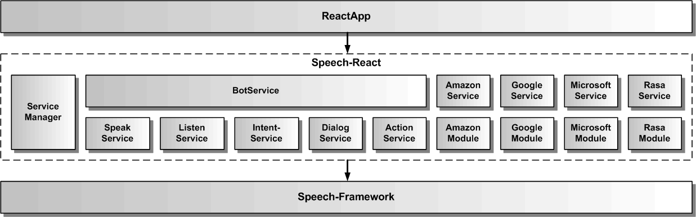

# Gesamtarchitektur des Speech-React SDKs

Die Speech-React Architektur umfasst verschiedene Services, die jeweils ein API für ein Feature des SDKs für die eigene ReactApp zur Verfügung stellen. Das Speech-React SDK bindet zur Erbringung seiner Funktionalität das Speech-Framework ein.

## Services

Um die Services in React verwenden zu können, verwaltet der ServiceManager alle Services. Der BotService verwendet die anderen Services und kombiniert sie zu einer komplexen Dialogfunktionalität. Der SpeakService dient zur Sprachausgabe von einzelnen Texten. Dazu verwendet er seinerseits entweder Sprachsynthese oder Audiodateien. Der ListenService dient zur Spracheingabe. Dazu verwendet er seinerseits Spracherkennung. Der IntentService dient zur Sprachanalyse von Texten, um deren Intention herauszufinden. Für die Sprachanalyse wird eine NLU mit einem Sprachmodell benötigt. Je nach verwendeter NLU, ob lokal oder cloudbasiert, muss das Sprachmodell über eine Web-Anwendung beim NLU-Anbieter für die eigene App erstellt werden. Zusätzlich benötigt man einen Account beim NLU-Anbieter. Der DialogService dient zur Ausführung von Dialogskripten.
Der ActionService dient zur Weiterleitung von Aktionen aus dem Bot an konkrete Funktionen oder Komponenten der ReactApp. Der AmazonService und GoogleService erlauben jeweils die Änderung ihrer Credentials. Die ReactApp kann jeden Service unabhängig von den anderen Services nutzen. [Hier](./../service/Service.md) werden alle Services beschrieben.

## Module

Neben den Services, die über den ServiceManager in React eingebunden werden, gibt es auch noch Module, die Speech-React um spezielle Funktionalität ergänzen. Dazu gehört das AmazonModule, welches den Amazon Cloud-Dienst in Speech-React einbindet und für den SpeakService die Amazon-TTS (Polly) verfügbar macht. Das MicrosoftModule bindet die Microsoft Cloud-Dienste ein und macht für den ListenService die Microsoft-ASR verfügbar. Das GoogleModule bindet den Google Cloud-Dienst ein und macht für den IntentService die Google-NLU (Dialogflow Version 1) verfügbar. [Hier](./../cloud/Cloud.md) werden die eingebundenen Cloud-Dienste beschrieben.
