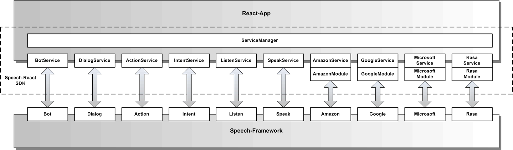
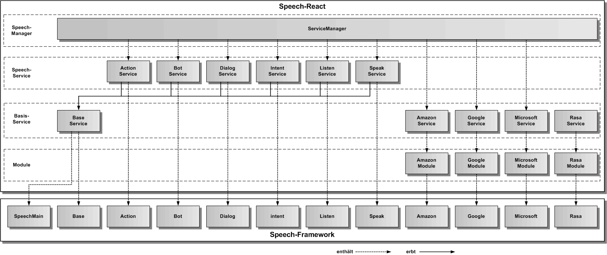

# Speech-React Services

Die Speech-React Services kapseln das Speech-Framework vollständig und definieren eine öffentliche Speech-Service API für eine React-App.

Die Speech-Services sind Service-Wrapperklassen für die gleichnamigen Speech-Framework Komponenten, wie in der oberen Grafik dargestellt. Alle für React verfügbaren Services werden im ServiceManager verwaltet. Darüber kann auf die einzelnen Services über ihre Namen zugegriffen werden. 

In der folgenden Grafik werden die Vererbungsbeziehungen der Speech-Service Klassen zur BaseService-Klasse und die Enthaltensein-Beziehungen zu den Speech-Framework Komponenten dargestellt.

Folgende Speech-Services gibt es:

* **[ActionService](./action/ActionService.md):** erlaubt die Fernsteuerung der Web-App über Aktionen

* **[BotService](./bot/BotService.md):** erlaubt die Ausführung eines Dialogs mit Sprachausgabe und Aktionen

* **[DialogService](./dialog/DialogService.md):** erlaubt die Ausführung eines Dialogs über die [Dialog-Skriptsprache](./bot/DialogScript.md)

* **[IntentService](./intent/IntentService.md):** erlaubt die Intentanalyse eines Textes

* **[ListenService](./listen/ListenService.md):** erlaubt die Spracheingabe und Umwandlung in Text

* **[SpeakService](./speak/SpeakService.md):** erlaubt die Sprachausgabe eines kurzen Textes

Folgende Basis-Services gibt es:

* **[BaseService](./base/BaseService.md):** beinhaltet die gemeinsame Grundfunktionalität der Speech-Services

* **[AmazonService](./amazon/AmazonService.md):** erlaubt die Änderung der Amazon-Credentials

* **[GoogleService](./google/GoogleService.md):** erlaubt die Änderung der Google-Credentials

* **[MicrosoftService](./microsoft/MicrosoftService.md):** erlaubt die Änderung der Microsoft-Credentials

Folgende Module gibt es:

* **[AmazonModule](./../cloud/amazon/Amazon.md):** verwaltet die Amazon Cloud-Dienstanbindung

* **[GoogleModule](./../cloud/google/Google.md):** verwaltet die Google Cloud-Dienstanbindung

* **[MicrosoftModule](./../cloud/microsoft/Microsoft.md):** verwaltet die Microsoft Cloud-Dienstanbindung

