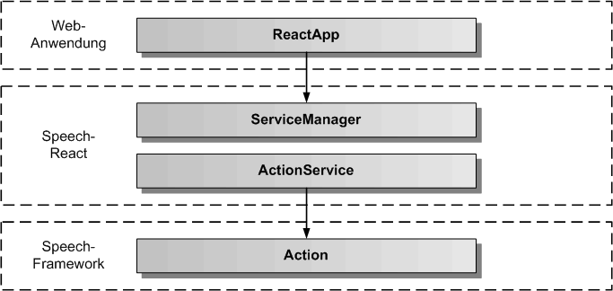

# ActionService

Der ActionService dient zum Weiterreichen einer Aktion an eine React-App. Dazu meldet die React-App Aktionsfunktionen oder Aktionselemente bei dem ActionService an, um über auszuführende Aktionen informiert zu werden. Der ActionService erbt vom abstrakten [BaseService](./../base/BaseService.md)

## Architektur

In der folgenden Grafik werden die einzelnen Schichten, angefangen von der ReactApp, über den ServiceManager und den ActionService von Speech-React, bis zur Action-Komponente in Speech-Framework, dargestellt. 

Die nächste Grafik zeigt die konkrete Vererbungsbeziehung zu BaseService, sowie die Einbindung von ActionFactory und ActionInterface aus dem Speech-Framework. ActionFactory ist eine statische Klasse und erzeugt das Action-Objekt zum ActionInterface. 

## API

Der ActionService definiert die öffentliche Schnittstelle von Speech-React für die Aktionsverarbeitung. Die folgende Grafik zeigt einen Überblick über die gesamte API des ActionServices. Die API teilt sich auf in Objektfunktionen, Objektereignisse und Objekteigenschaften. Die API verfügt über eine auf Funktionen und eine auf Eigenschaften basierende Schnittstelle. Die gleiche Aufgabe kann über Funktionsaufrufe oder über das Setzen von Eigenschaften erledigt werden. Z.B. kann die auszuführende Aktion entweder mit actionService.setActionName('blink') oder mit actonService.action = 'blink' eingetragen werden, bevor mit actionService.start() die Aktionsausführung gestartet wird. 

## Importieren

Um den ActionService importieren zu können, muss in der jeweiligen Komponente folgende Zeile eingefügt werden:

	import { SPEECH_ACTION_SERVICE, ServiceManager, ActionService } from 'speech-react'
	
Dazu müssen das Speech-Framework und das Speech-React npm-Paket in der gleichen Version vorher ins eigene ReactApp-Projekt kopiert und installiert worden sein.

	$ npm install speech-framework-<version>.tgz
	$ npm install speech-react-<version>.tgz
	 

## Konfiguration

In ActionService können das activeFlag und das errorOutputFlag als Konfiguration über die optionalen Parameter gesetzt werden. 

## Aktionen ausführen/stoppen

Um eine Aktion ausführen zu können, müssen zuerst die Start- und Stop-Callback Funktionen für eine Aktion zum ActionService hinzugefügt werden. Vor dem Aufruf von ActionService.start() sollten die Eigenschaften actionService.action, sctionServie.type und actionService.element eingetragen werden.

## Aktionsfunktionen hinzufügen/entfernen

Um Aktionen ausführen zu können gibt es zwei Möglichkeiten, seine Callback-Funktionen für eine Aktion hinzuzufügen. Es kann ein Aktionsname festgelegt werden, unter dem man die Start- und Stop-Callbacks der Aktion hinzufügt. Oder man definiert ein Aktionselement, unter dessen Namen man die Start- und Stop-Callbacks der Aktion hinzufügt.

Hier wird die erste Möglichkeit beschrieben. Eine Aktion wird mit ihren Namen festgelegt und unter diesem Aktionsnamen werden die Start- und Stop-Callbacks eingetragen. Dann kann man die Aktion mit diesem Aktionsnamen ausführen. Der vorher eingetragene Start-Callback zu diesem Aktionsnamen wird daraufhin aufgerufen. Der startEvent wird zusätzlich gesendet.
Der Start-Callback Funktion werden der Aktionsname, der Elementtyp und der Elementname übergeben.

Auszug aus der Datei: src/speech/action/action-service-data.interface.ts:

	// diese Daten werden der Start-Callback Funktion mit uebergeben

	export interface ActionServiceDataInterface {
	    /** definierte Aktion, ist ActionName in ActionService */
	    action: string;
	    /** Objekttyp fuer die Aktion, ist ElementType in ActionService */
	    type: string; 
	    /** eindeutiger Objektname fuer die Aktion, ist ElementName in ActionService */
	    id: string;
	}

Beispiel-Komponente für das Ausführen einer Aktion zu einem ActionName:

	import React from 'react';

	// ActionService 
		
	import { SPEECH_ACTION_SERVICE, ServiceManager, ActionService, ActionServiceDataInterface } from 'speech-react';

	
	export class ActionComponent extends React.Component {
	
		actionService: ActionService = null;
		actionStartEvent = null;
		actionStopEvent = null;
		actionErrorEvent = null;
	
		constructor() {
			this.actionService = ServiceManager.get( SPEECH_ACTION_SERVICE );
		}

		// Blink-Methoden fuer Blink-Aktion

		_blinkStart( aActionData: ActionServiceDataInterface ): number {
			// hier kann ein beliebiger Code zum Erzeugen des Blinkens stehen
			console.log('Blinken wird ausgefuehrt');
			// eine Sekunde warten, vor Beenden der Aktion
			setTimeout(() => this.actionStop(), 1000 );
			return 0;
		}
				
		_blinkStop(): number {
			// hier kann ein beliebiger Code zum Beenden des Blinkens stehen
			console.log('Blinken wird beendet');
			return 0;
		}		
		
		componentDidMount() {
			// Action-Ereignisse eintragen
			this.actionStartEvent = actionService.startEvent.subscribe(() => console.log('Aktionsausführung gestartet'));
			this.actionStopEvent = actionService.stopEvent.subscribe(() => console.log('Aktionsausführung beendet'));
			this.actionErrorEvent = actionService.errorEvent.subscribe(aError => console.log('Fehler:', aError.message));
			// Action-Funktion fuer blinken hinzufuegen, Methoden muessen in Funktionen eingekapselt werden !
			this.actionService.addFunction('blink', (aActionData: ActionServiceDataInterface) => this._blinkStart(aActionData), () => this._blinkStop()); 
		}
	
		componentWillUnmount() {
			// Action-Ereignisse freigeben
			this.actionStartEvent.unsubscribe();
			this.actionStopEvent.unsubscribe();
			this.actionErrorEvent.unsubscribe();
			// Action-Funktion wieder entfernen
			this.actionService.removeFunction('blink');
		}

		// eigene Funktionen fuer die Aktionsausfuehrung in einer eigenen React-Komponente

		blinkAction() {
			this.actionService.action = 'blink';
			this.actionService.type = 'Button';
			this.actionService.element = 'enter';
			this.actionService.start();
		}
		
		stopAction() {
			this.actionService.stop();
		}

	  	render() {
	    	return (
	      		

	      			<button onclick="blinkAction()">
	      				Action starten
					</button>
	      			<button onclick="stopAction()">
	      				Action stoppen
					</button>
	     		

	    	);
	  	}
	}

## Aktionselemente hinzufügen/entfernen

Die andere Möglichkeit zum Hinzufügen von Start- und Stop-Callback Funktionen ist die Definition eines Aktionselementes.
Ein Aktionselement ist nicht an den ActionName gebunden sondern an den ElementName. Die Aktion wird ausgelöst, wenn ein
passender ElementName gefunden wird. Das Element kann dann selbst bestimmen, was es bei welchem übergebenen ActionName und ElementType tun will. Diese Variante der Aktionsauslösung ist vor allem für Direktiven interessant.
Anders als bei Aktionsfunktionen, wo eine Aktion beliebig viele eingetragene Funktions-Callbacks parallel ausführen kann, wird hier ein Element mit beliebig vielen unterschiedlichen Aktionsfunktionen ausgeführt, wobei nur ein Element ausgewählt wird und eine Aktion im Element ausgeführt wird. Diese Variante der Aktionsausführung ist wesentlich spezifischer und erzeugt weniger unnötige Funktionsaufrufe.

Beispiel-Komponente für das Ausführen einer Aktion zu einem ElementName:

	import React from 'react';

	// ActionService 
		
	import { SPEECH_ACTION_SERVICE, ServiceManager, ActionService, ActionServiceDataInterface } from 'speech-angular';

	
	export class ActionComponent extends React.Component {
	
		actionService: ActionService = null;
		actionStartEvent = null;
		actionStopEvent = null;
		actionErrorEvent = null;
		actionLastName = '';
	
		constructor() {
			this.actionService = ServiceManager.get( SPEECH_ACTION_SERVICE );
		}

		// Blink-Methoden fuer Blink-Aktion

		_blinkStart(): number {
			// hier kann ein beliebiger Code zum Erzeugen des Blinkens stehen
			console.log('Blinken wird ausgefuehrt');
			// eine Sekunde warten, vor Beenden der Aktion
			setTimeout(() => this.actionStop(), 1000 );
			return 0;
		}
				
		_blinkStop(): number {
			// hier kann ein beliebiger Code zum Beenden des Blinkens stehen
			console.log('Blinken wird beendet');
			return 0;
		}		
		
		// Action-Methoden des Elementes
		
		_actionStart( aActionData: ActionServiceDataInterface ): number {
			// Auswahl der Action, die vom Element ausgefuehrt werden soll
			switch ( aActionData.action ) {
				case: 'blink':
					this._blinkStart();
					this.actionLastName = 'blink';
					break;
				default:
					break;
			}
		}
		
		_actionStop(): number {
			switch( this.actionLastName ) {
				// Auswahl der Aktion, die vom Element ausgefuehrt werden soll
				case 'blink':
					this._blinkStop();
					break;
				default:
					break;
			}
			this.actionLastName = '';
		}
		
		componentDidMount() {
			// Action-Ereignisse eintragen
			this.actionStartEvent = actionService.startEvent.subscribe(() => console.log('Aktionsausführung gestartet'));
			this.actionStopEvent = actionService.stopEvent.subscribe(() => console.log('Aktionsausführung beendet'));
			this.actionErrorEvent = actionService.errorEvent.subscribe(aError => console.log('Fehler:', aError.message));
			// Action-Funktion fuer blinken hinzufuegen, Methoden muessen in Funktionen eingekapselt werden !
			this.actionService.addElement('ActionComponent', (aActionData: ActionServiceDataInterface) => this._actionStart(aActionData), () => this._actionStop()); 
		}
	
		componentWillUnmount() {
			// Action-Ereignisse freigeben
			this.actionStartEvent.unsubscribe();
			this.actionStopEvent.unsubscribe();
			this.actionErrorEvent.unsubscribe();
			// Action-Funktion wieder entfernen
			this.actionService.removeFunction('blink');
		}

		// eigene Funktionen fuer die Aktionsausfuehrung in einer eigenen React-Komponente

		blinkAction() {
			this.actionService.action = 'blink';
			this.actionService.type = 'Button';
			this.actionService.element = 'ActionComponent';
			this.actionService.start();
		}
		
		stopAction() {
			this.actionService.stop();
		}
		
	  	render() {
	    	return (
	      		

	      			<button onclick="blinkAction()">
	      				Action starten
					</button>
	      			<button onclick="stopAction()">
	      				Action stoppen
					</button>
	     		

	    	);
	  	}
	}

