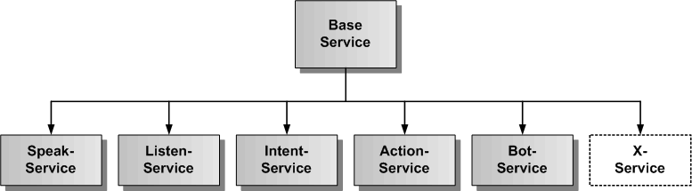
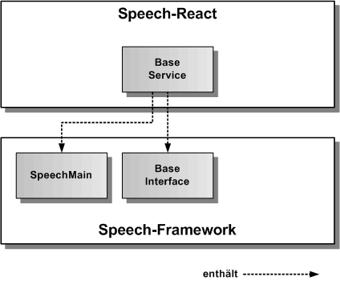
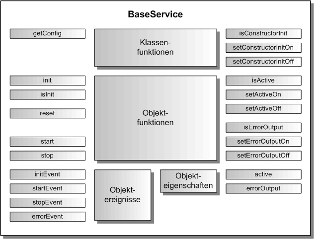

# BaseService

Jeder Speech-React Service ist gleichartig aufgebaut und beinhaltet die gleiche geerbte Grundfunktionalität von BaseService, die hier kurz beschrieben wird.

## Architektur

In der folgenden Grafik wird der BaseService als abstrakte Klasse dargestellt. Die anderen Speech-Services erben diese Basisfunktionalität.

BaseService verbindet sich mit dem SpeechMain Singleton und bindet die Schnittstelle der Base-Komponente aus Speech-Framework ein, wie in der nächsten Grafik dargestellt. SpeechMain ist das oberste Objekt zur Initialisierung von Speech-Framework und BaseInterface definiert die abstrakte Basisschnittstelle aller exportierbaren Komponenten des Speech-Frameworks.

## API

Jeder Speech-React Service besitzt die gleiche Schnittstelle für die hier vorgestellte Grundfunktionalität. Die folgende Grafik zeigt einen Überblick über die gesamte API jedes Speech-React Services. Die API teilt sich auf in statische Klassenfunktionen, Objektfunktionen, Objektereignisse und Objekteigenschaften. Die API verfügt über eine auf Funktionen und eine auf Eigenschaften basierende Schnittstelle. Die gleiche Aufgabe kann über Funktionsaufrufe oder über das Setzen von Eigenschaften erledigt werden.

Die statischen Klassenfunktionen dienen der Konfiguration eines Services vor seiner Erzeugung, sowie der Festlegung, ob die init()-Funktion im Konstruktor des Services bereits aufgerufen wird oder nicht. Dazu werden die Klassenfunktionen mit dem Klassennamen des Services aufgerufen, wie z.B. die Rückgabe der Konfiguration mit service.getConfig().
Die Objektereignisse geben EventEmitter (RxJS) zurück, diese sollten mit subscribe aufgerufen werden und die Rückgabe sollte in einer Variablen für den Aufruf von unsubscribe gespeichert werden:

	// Setzen einer Ereignisfunktion mit subscribe
	const errorEvent = service.errorEvent.subscribe( aError => console.log('Fehlerausgabe:', aError.message));
	...
	// Freigabe der Ereignisfunktion mit unsubscribe
	errorEvent.unsubscribe();

## Importieren

Um einen Service importieren zu können, muss in der jeweiligen Komponente folgende Zeile eingefügt werden:

	import { SPEECH_XXX_SERVICE, ServiceManager, XxxService } from 'speech-react'
	
	
Im Konstruktor der Komponente sollte dann folgende Zeile stehen, um den Service zu holen:

	
	consructor() {
		this.service = ServiceManager( SPEECH_XXX_SERVICE );
	}
	
Dem ServiceManager wird der Name des Speech-Services übergeben und der jeweilige Speech-Service wird zurückgegeben.	
		
Dazu müssen das Speech-Framework und das Speech-React npm-Paket in der gleichen Version vorher ins eigene ReactApp-Projekt kopiert und installiert worden sein.

	$ npm install --save speech-framework-<version>.tgz
	$ npm install --save speech-react-<version>.tgz
	 

## Konfiguration

Dier erste Aufgabe vor Nutzung eines Services besteht in der Festlegung der Konfiguration vor der Erzeugung des Services in React. In der Defaulteinstellung wird die init()-Funktion im Konstruktor aufgerufen und die voreingestellte Konfiguration übernommen. Will man die Defaultkonfiguration überschreiben, holt man sie sich mittels der Klassenfunktion service.getConfig(). Diese Funktion gibt das ServiceConfig-Objekt eines Services zurück. 

Grundelemente jeder Service-Konfiguration:

	// hier sind die Defaultwerte des SpeakService festgelegt	
	export const SpeakServiceConfig: SpeakServiceOptionInterface = {
	    /** ein/ausschalten des Service */
	    activeFlag: true,
	    
	    // hier kommen die servicespezifischen Konfigurationsparameter hin
	    
	    /** legt fest, ob die Fehlermeldungen zusaetzlich auf der Konsole ausgegeben werden */
	    errorOutputFlag: false
	};

Die Konfiguration kann man vor der Initialisierung der Services über ServiceManager.init() in App.tsx vornehmen, da sie vor der Erzeugung der Speech-react Services im ServiceManager stattfinden muss.

Auszug aus der Datei: src/App.tsx:

	import React from 'react';

	// XxxService von Speech-React
	
	import { ServiceManager, XxxService } from 'speech-react';
	
	
	export class App extends React.Component{
		
		// nur hier kann die Service-Konfiguration geaendert werden
		
		constructor() {
			// XxxService-Konfiguration holen
			const serviceConfig = XxxService.getConfig();
			// hier kann man alle Konfigurationswerte aendern, diese werden bei der Initialsierung uebernommen
			// es muessen nur die von den Defaultwerten abweichenden Werte eingetragen werden
			serviceConfig.activeFlag = false;
			
			// hier kommen die servicespezifischen Konfigurationsparameter hin
						
			serviceConfig.errorOutputFlag = true;
			
			// alle Services erzeugen
			
			ServiceManager.init();
		}
		
		...
	
	}

Soll die init()-Funktion manuell nach der Erzeugung des Service aufgerufen werden, so muss im AppModule-Konstruktor die Klassenfunktion Service.setConstructorInitOff() aufgerufen werden. Damit schaltet man den Aufruf von init() im Service-Konstruktor aus.

Auszug aus der Datei: src/App.tsx:

	... 
	export class App extends React.Component {
		
		// nur hier kann die XxxService-Konfiguration geaendert werden, da der Konstruktor von XxxService
		// noch nicht aufgerufen worden ist
		constructor() {
			XxxService.setConstructorInitOff();

			// alle Services erzeugen
			
			ServiceManager.init();
		}
	
	}

Die init()-Funktion kann man dann zu einem beliebig späteren Zeitpunkt z.B. in einer Komponente mit eigenen optionalen Parametern aufrufen.

Auszug aus der Datei: src/XxxComponent.tsx:

	import React from 'react';
	
	// Speech-React
	
	import { SPEECH_XXX_SERVICE, ServiceManager, XxxService } from 'speech-react';
	
	// Xxx-Komponente
	
	export class XxxComponent extends React.Component {
	
		service: XxxService = null;

		constructor() {
			this.service = ServiceManager( SPEECH_XXX_SERVICE );

			// Hier wird der XxxService manuell mit optionalen Parametern initialisiert
	  		service.init({ errorOutputFlag: true });
	  	}
	
		...
			
	}

## Service ein/ausschalten 

Jeder Speech-React Service kann aktiviert und deaktiviert werden. Zu Beginn ist er defaultmäßig immer aktiviert, es sei denn, man hat in der Konfiguration das activeFlag auf false gesetzt, oder die zugrunde liegende Funktionalität des Speech-Frameworks steht nicht zur Verfügung. Für das Setzen auf aktiv ein/aus kann man die Funtionen service.setActiveOn() und service.setActiveOff() benutzen, oder man setzt die Eigenschaft service.active auf true oder false. Ist der Service aktiv, werden alle Funktionen des Service ausgeführt, ist der Service deaktiviert, werden global keine seiner Funktionen ausgeführt. Prüfen kann man den Aktivzustand über service.isActive()-Funktion oder man liest die Eigenschaft service.active aus. 

	// Service einschalten per Funktion
	service.setActiveOn();
	// oder per Eigenschaft
	service.active = true;
	
	// Service ausschalten per Funktion
	service.setActiveOff();
	// oder per Eigenschaft
	service.active = false;
	
	// Abfrage auf aktiv per Funktion
	if ( service.isActive()) { ... }
	// oder per Eigenschaft
	if ( service.active ) { ... }
		

## Fehlerausgabe auf die Entwicklerkonsole

Bei der Integration eines Speech-React Services ist es mitunter sinnvoll, seine Fehlerausgaben auf die Entwicklerkonsole sofort auszugeben, um die Ursache eines Problems schneller finden zu können. Dazu kann die Fehlerausgabe auf die Konsole ein- und ausgeschaltet werden. Mit den Funktionen service.setErrorOutputOn() und service.setErrorOutputOff() kann man die Fehlerausgabe ein- und ausschalten. Mit der service.isErrorOutput()-Funktion kann man den Zustand für die Fehlerausgabe abfragen. Für das Setzen der Fehlerausgabe gibt es die Eigenschaft service.errorOutput, in die man true oder false eintrqagen kann, die man aber auch auslesen kann. Das errorOutputFlag kann auch in der Konfiguration gesetzt werden.  

	// Fehlerausgabe einschalten per Funktion
	service.setErrorOutputOn();
	// oder per Eigenschaft
	service.errorOutput = true;
	
	// Fehlerausgabe ausschalten per Funktion
	service.setErrorOutputOff();
	// oder per Eigenschaft
	service.errorOutput = false;
	
	// Abfrage auf aktiv per Funktion
	if ( service.isErrorOutput()) { ... }
	// oder per Eigenschaft
	if ( service.errorOutput ) { ... }

## Service initialisieren

Es kann jederzeit die service.init()-Funktion aufgerufen werden, wobei nur die übergebenen optionalen Parameter neu gesetzt werden. Will man den Service komplett auf seine Defaultkonfiguration zurücksetzen sollte man service.reset() verwenden. Ruft man service.init() ohne optionale Parameter auf, hat dies keinen Effekt.

## Service zurücksetzen

Der Service kann mit der service.reset()-Funktion auf seine Defaultkonfiguration und Einstellungen zurückgesetzt werden. 
Auch hier können optionale Parameter mitübergeben werden, die dann gesetzt werden.

## Service Fehlerereignis

Jeder Speech-React Service besitzt ein errorEvent, den man mit einer eigenen Fehlerfunktion belegen kann, um Fehler zu erhalten und behandeln zu können. Weitere Ereignisse werden spervicespezifisch definiert.

## Service starten und stoppen

Jeder Speech-React Service wird mit service.start() ausgeführt und mit service.stop() wieder beendet. Optional können vorher Eigenschaften des Services gesetzt werden, die er zu seiner Ausführung benötigt. 

Beispiel-Komponente für die Integration Speak-Services:

	import React from 'react';

	// Speech-React
		
	import { SPEECH_SPEAK_SERVICE, ServiceManager, SpeakService } from 'speech-react';

	
	export class SpeakComponent extends React.Component {
	
		service: SpeakService = null;
		errorEvent = null;
	
		constructor() {
			this.service = ServiceManager.get( SPEECH_SPEAK_SERVICE );
		}
		
		// Fehlerereignis eintragen
				
		componentDidMount() {
			this.errorEvent = service.errorEvent.subscribe(aError => console.log('Fehler:', aError.message));
		}

		// Fehlerereignis freigeben
		
		componentWillUnmount() {
			this.errorEvent.unsubscribe();
		}

		// eigene Funktionen zur Einbindung des Speech-React Services in einer eigenen React-Komponente

		startService() {
			this.service.text = 'Der Speak-Service wurde gestartet';
			this.service.start();
		}
		
		stopService() {
			this.service.stop();
		}
		
		render() {
	    	return (
	      		

	      			<button onclick="startService()">
	      				Service starten
					</button>
	      			<button onclick="stopService()">
	      				Service stoppen
					</button>
	     		

	    	);
		}
	}
