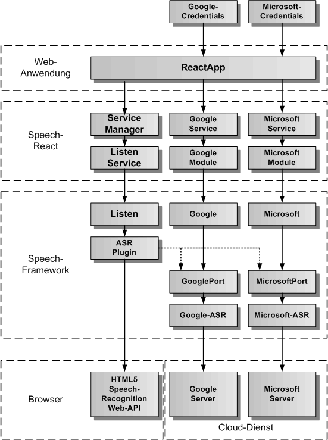
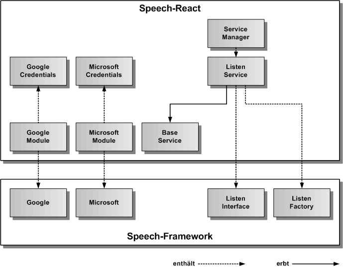
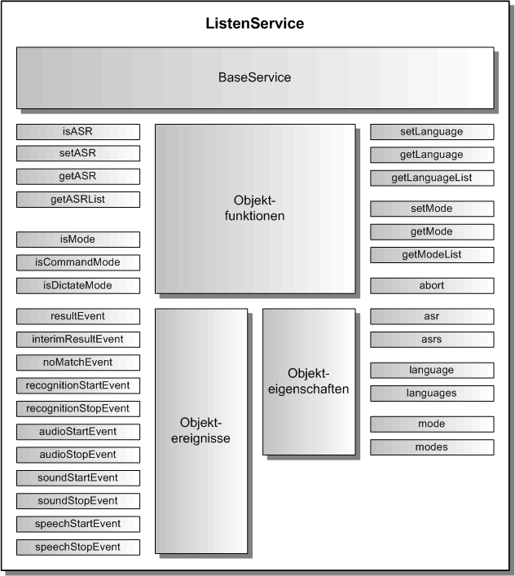

# ListenService

Der ListenService dient zur Spracherkennung von Texten. Für die Spracherkennung wird standardmäßig HTML5 SpeechRecognition Web-API verwendet. Der ListenService erbt vom abstrakten [BaseService](./../base/BaseService.md).

## Architektur

In der folgenden Grafik werden die einzelnen Schichten, angefangen von der ReactApp, über den ServiceManager und den ListenService von Speech-React, die Listen-Komponente in Speech-Framework, das Plugin für ASR (Speech-to-Text), bis hinunter zur Standardschnittstelle des Browsers für SpeechRecognition, dargestellt. 

Die nächste Grafik zeigt die konkrete Vererbungsbeziehung zu BaseService, sowie die Einbindung von ListenFactory und ListenInterface aus dem Speech-Framework. ListenFactory ist eine statische Klasse und erzeugt das Listen-Objekt zum ListenInterface.

## API

Der ListenService definiert die öffentliche Schnittstelle von Speech-React für die Spracheingabe. Die folgende Grafik zeigt einen Überblick über die gesamte API des ListenServices. Die API teilt sich auf in statische Klassenfunktionen, Objektfunktionen, Objektereignisse und Objekteigenschaften. Die API verfügt über eine auf Funktionen und eine auf Eigenschaften basierende Schnittstelle. Die gleiche Aufgabe kann über Funktionsaufrufe oder über das Setzen von Eigenschaften erledigt werden. Z.B. kann die Sprache entweder mit listenService.setLanguage('de') oder mit listenService.language = 'de' eingetragen werden, bevor mit listenService.start() die Spracheingabe gestartet wird.
Der Modus bestimmt, ob Listen im Command-Modus oder im Diktier-Modus verwendet wird. Im Command-Modus wird nur ein einziger kurzer Satz erfasst, während im Diktier-Modus die ASR solange Sprache in Text übersetzt, bis Listen gestoppt wird. Dabei werden auch einige Interpunktionszeichen beachtet. Der Diktiermodus funtioniert zur Zeit nur mit der HTML5-ASR und kann nur im Chrome-Browser verwendet werden.

## Importieren

Um den ListenService importieren zu können, muss in der jeweiligen Komponente folgende Zeile eingefügt werden:

	import { SPEECH_LISTEN_SERVICE, ServiceManager, ListenService } from 'speech-react'
	
Dazu müssen das Speech-Framework und das Speech-React npm-Paket in der gleichen Version vorher ins eigene ReactApp-Projekt kopiert und installiert worden sein.

	$ npm install speech-framework-<version>.tgz
	$ npm install speech-react-<version>.tgz
	 
Alternativ kann man Speech-React aus dem globalen NPM-Repository installieren. Dann wird Speech-Framework automatisch mitinstalliert.

	$ npm install speech-react
	

## Konfiguration

Dier erste Aufgabe vor Nutzung des ListenService besteht in der Festlegung der Konfiguration vor der Erzeugung des Services in Angular. In der Defaulteinstellung wird die init()-Funktion im Konstruktor aufgerufen und die voreingestellte Konfiguration übernommen. Will man die Defaultkonfiguration überschreiben, holt man sie sich mittels der Klassenfunktion ListenService.getConfig(). Diese Funktion gibt das ListenConfig-Objekt des ListenServices zurück. 

Auszug aus der Datei: src/speech/listen/listen-service-config.ts:

	// hier sind die Defaultwerte des ListenService festgelegt	
	export const ListenServiceConfig: ListenServiceOptionInterface = {
	    /** ein/ausschalten der Listen-Komponente */
	    activeFlag: true,
	    /** setzt die Sprache fuer die Sprachausgabe ( 'de', 'en' )*/
	    listenLanguage: 'de',
	    /** legt fest, ob die Fehlermeldungen zusaetzlich auf der Konsole ausgegeben werden */
	    errorOutputFlag: false
	};

## Spracheingabe

Um Sprache zu erfassen, muss zuerst die Sprache festgelegt werden. Hier hat man die Wahl zwischen den Funktionen zum Eintragen der Werte, oder den Eigenschaften. Die Sprache kann auch in der Konfiguration mit dem Parameter listenLanguage eingetragen werden. Es gibt zwei Konstanten für die Sprache Deutsch ('de') und Englisch ('en'), die immer verwendet werden sollten, wenn man die Sprache eintragen will. Hat man diese Werte eingetragen kann man die Spracheingabe mit listenService.start() beginnen und mit listenService.stop() wieder beenden. Der ListenService ist so eingestellt, das die Spracherfassung automatisch beendet wird, wenn nicht mehr gesprochen wird. Nach dem Start der Spracheingabe erhält man das Ereignis startEvent und nach dem Ende der Spracheingabe das Ereignis stopEvent. Falls ein Fehler auftritt, erhält man das Ereignis errorEvent. Das Ergebnis der Spracheingabe erhält man über das Ereignis resultEvent, bei dem der erkannte Text mit übergeben wird.

Beispiel-Komponente für die Integration von Sprache:

	import React from 'react';

	// ListenService 
		
	import { SPEECH_LISTEN_SERVICE, ServiceManager, ListenService, LISTEN_DE_LANGUAGE, LISTEN_EN_ALANGUAGE } from 'speech-react';

	
	export class ListenComponent extends React.Component {
	
		listenService: ListenService = null;
		listenStartEvent = null;
		listenStopEvent = null;
		listenResultEvent = null;
		listenErrorEvent = null;
	
		constructor() {
			this.listenService = ServiceManager.get( SPEECH_LISTEN_SERVICE );
		}
		
		// Listen-Ereignisse eintragen
				
		componentDidMount() {
			this.listenStartEvent = listenService.startEvent.subscribe(() => console.log('Sprachausgabe gestartet'));
			this.listenStopEvent = listenService.stopEvent.subscribe(() => console.log('Sprachausgabe beendet'));
			this.listenResultEvent = listenService.resultEvent.subscribe(aResultText => console.log('Spracheingabe Ergebnistext:', aResultText));
			this.listenErrorEvent = listenService.errorEvent.subscribe(aError => console.log('Spracheingabe Fehler:', aError.message));
		}

		// Listen-Ereignisse freigeben
		
		componentWillUnmount() {
			this.listenStartEvent.unsubscribe();
			this.listenStopEvent.unsubscribe();
			this.listenResultEvent.unsubscribe();
			this.listenErrorEvent.unsubscribe();
		}

		// eigene Funktionen fuer die Spracheingabe in einer eigenen React-Komponente

		listenGerman() {
			this.listenService.language = LISTEN_DE_LANGUAGE;
			this.listenService.start();
		}
		
		listenEnglish()	{
			this.listenService.language = LISTEN_EN_LANGUAGE;
			this.listenService.start();
		}	

		listenStop() {
			this.listenService.stop();
		}
		
	  	render() {
	    	return (
	      		

	      			<button onclick="listenGerman()">
	      				Spracheingabe starten
					</button>
	      			<button onclick="listenStop()">
	      				Spracheingabe stoppen
					</button>
	     		

	    	);
	  	}

	}

